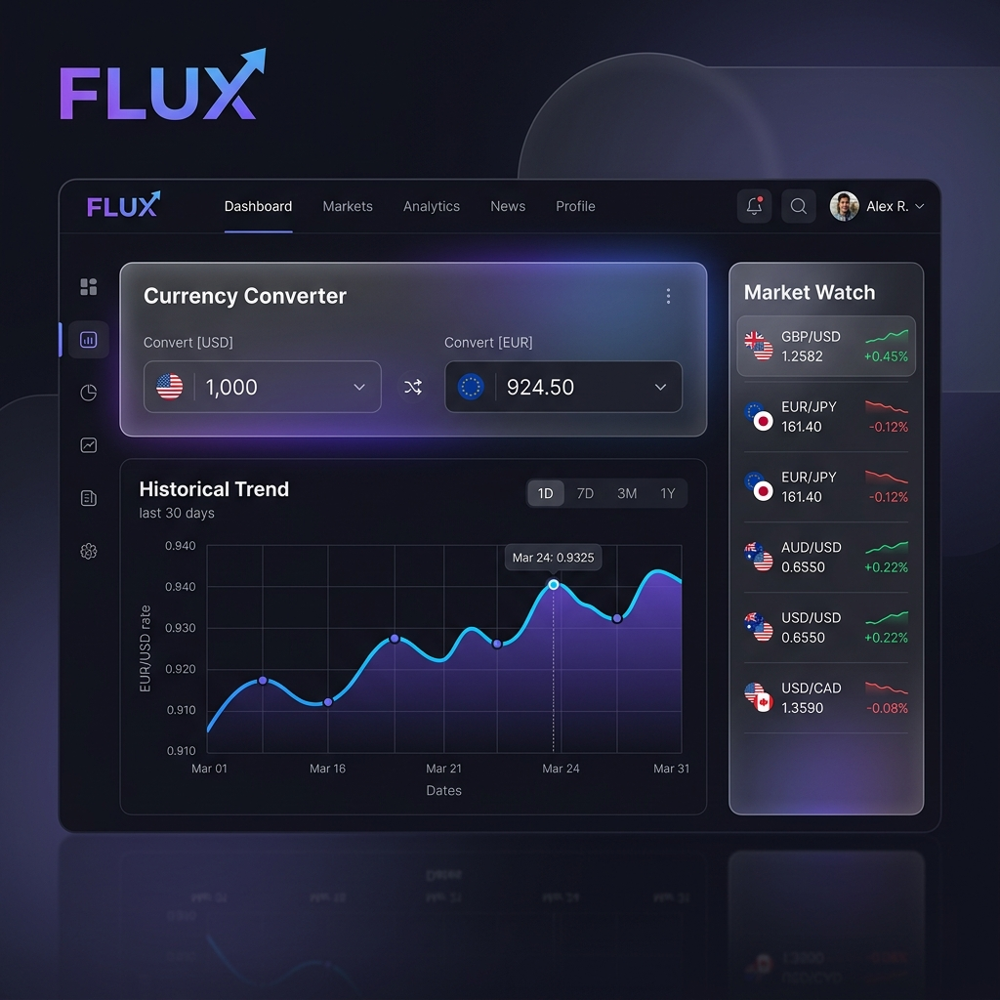

# ⚡ FLUX | Pro Currency Intelligence



**FLUX** is a high-performance, professional-grade currency intelligence dashboard designed for modern traders and financial analysts. It combines real-time institutional exchange rates with advanced data visualization and a premium "Glassmorphism" aesthetic.

---

## ✨ Key Features

### 🏦 Intelligence Converter
*   **Real-Time Sync**: Fetches the latest market rates instantly using high-performance API entry points.
*   **Integrated Math Engine**: Supports complex mathematical expressions (e.g., `1000 * 1.05 + 50`) directly within the amount field.
*   **Smart Formatting**: Automated currency precision and international number formatting.

### 📉 Historical Trend Analysis
*   **Market Sentiment Visualization**: A dynamic line chart powered by **Chart.js** that visualizes short-term price action.
*   **Micro-Volatility Simulation**: Represents intraday spot market fluctuations to provide a "living" market feel.

### 🔭 Market Watch (Global Performance)
*   **Dynamic Watchlist**: Automatically tracks the performance of the chosen base currency against a basket of G10 and major currencies (EUR, GBP, JPY, CNY, etc.).
*   **Momentum Indicators**: Real-time percentage change tracking (▲/▼) to identify market trends at a glance.

### 🌗 Premium UI/UX
*   **Glassmorphism Effects**: A sleek, multi-layered interface with backdrop-blurs and mesh gradients.
*   **Professional Dark/Light Modes**: Integrated theme toggling for different lighting environments.
*   **Responsive Architecture**: Fully optimized for desktop, tablet, and mobile viewport performance.

---

## 🚀 Technical Architecture

| Layer | Technology |
| :--- | :--- |
| **Logic** | ES6+ JavaScript (Asynchronous Engine) |
| **Styling** | Vanilla CSS3 (Custom Design System / CSS Variables) |
| **Data Visualization** | Chart.js 4.0 |
| **API Integration** | Fawaz Ahmed's Currency API (Institutional Grade) |
| **Assets** | FlagsAPI (Real-time SVG delivery) |

---

## 🛠️ Installation & Usage

1.  **Clone the Repository**:
    ```bash
    git clone https://github.com/Imtiaz-Ali17314/FLUX-currency-converter
    ```
2.  **Launch**:
    Open `index.html` in any modern browser (Chrome, Safari, Edge, or Firefox).

*No dependencies or build steps required. Optimized for zero-latency execution.*

---

## 📝 Design Philosophy

FLUX was built on the principle that financial tools should be as beautiful as they are functional. By moving away from "flat" design and embracing depth, transparency, and micro-animations, FLUX provides a user experience that rivals institutional Bloomberg/Reuters terminals in aesthetic quality.

---

## 📜 License
© 2026 FLUX Intelligence. This project is shared for informational and professional portfolio purposes.
